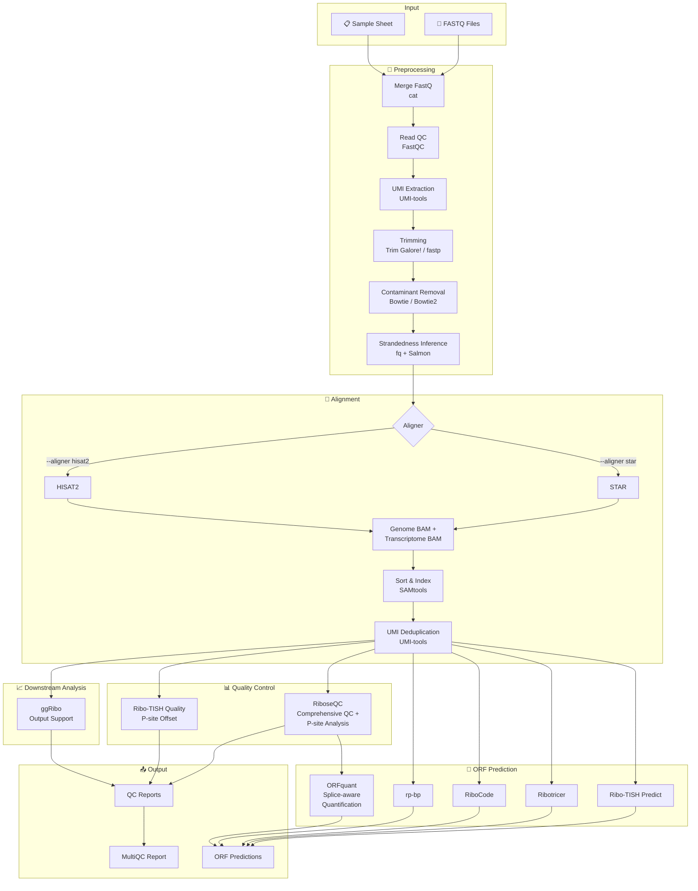

<h1>
  <picture>
    <source media="(prefers-color-scheme: dark)" srcset="docs/images/nf-core-riboseq_logo_dark.png">
    
  </picture>
</h1>

[](https://github.com/nf-core/riboseq/actions/workflows/ci.yml)
[](https://github.com/nf-core/riboseq/actions/workflows/linting.yml)[](https://nf-co.re/riboseq/results)[](https://doi.org/10.5281/zenodo.10966364)
[](https://www.nf-test.com)

[](https://www.nextflow.io/)
[](https://docs.conda.io/en/latest/)
[](https://www.docker.com/)
[](https://sylabs.io/docs/)
[](https://cloud.seqera.io/launch?pipeline=https://github.com/nf-core/riboseq)

[](https://nfcore.slack.com/channels/riboseq)[](https://twitter.com/nf_core)[](https://mstdn.science/@nf_core)[](https://www.youtube.com/c/nf-core)

## Introduction

**nf-core/riboseq** is a bioinformatics pipeline for analysis of Ribo-seq data. It borrows heavily from nf-core/rnaseq in the preprocessing stages.

### Tutorial Resources

For lab-facing onboarding materials and an interactive notebook, see:

- [Lab Tutorial / 实验室教学版 Vignette](docs/lab_tutorial.md)
- [Guided Tutorial Notebook](docs/notebooks/riboseq_guided_tutorial.ipynb)
- [Metadata helper script](scripts/fetch_public_metadata.py)

### Pipeline Overview



### Preprocessing Steps

1. Merge re-sequenced FastQ files ([`cat`](http://www.linfo.org/cat.html))
2. Sub-sample FastQ files and auto-infer strandedness ([`fq`](https://github.com/stjude-rust-labs/fq), [`Salmon`](https://combine-lab.github.io/salmon/))
3. Read QC ([`FastQC`](https://www.bioinformatics.babraham.ac.uk/projects/fastqc/))
4. UMI extraction ([`UMI-tools`](https://github.com/CGATOxford/UMI-tools))
5. Adapter and quality trimming ([`Trim Galore!`](https://github.com/FelixKrueger/TrimGalore) or [`fastp`](https://github.com/OpenGene/fastp))
6. Removal of ribosomal/contaminant reads ([`Bowtie`](http://bowtie-bio.sourceforge.net/index.shtml) or [`Bowtie2`](http://bowtie-bio.sourceforge.net/bowtie2/index.shtml))
7. Genome alignment with [`STAR`](https://github.com/alexdobin/STAR) or [`HISAT2`](http://daehwankimlab.github.io/hisat2/), outputting both genome and transcriptome alignments
8. Sort and index alignments ([`SAMtools`](https://sourceforge.net/projects/samtools/files/samtools/))
9. UMI-based deduplication ([`UMI-tools`](https://github.com/CGATOxford/UMI-tools))

### Ribo-seq Quality Control

1. **RiboseQC**: Comprehensive quality control including read length distribution, P-site analysis, metagene profiles, codon periodicity, and frame bias ([`RiboseQC`](https://github.com/ohlerlab/RiboseQC))
2. **Ribo-TISH Quality**: Check reads distribution around annotated protein coding regions, show frame bias and estimate P-site offset ([`Ribo-TISH`](https://github.com/zhpn1024/ribotish))
3. **ggRibo Output**: Generates compatible output files for visualization with the [`ggRibo`](https://github.com/hsinyenwu/ggRibo) R package.

> [!IMPORTANT]
> **QC and sORF prediction filtering policy** (IMPLEMENTED)
>
> The pipeline implements a strict separation between **QC** and **sORF prediction inputs**:
>
> - **RiboseQC is applied only to samples with `type=riboseq`, and now uses filtered BAMs.**
> - The pipeline runs the **QC suite twice** on `type=riboseq` samples:
>   - **Pre-filter QC** on *unfiltered* genome BAMs (Ribo-TISH Quality, Ribotricer QC) for baseline QC and comparability.
>   - **Post-filter QC** on *filtered* genome BAMs (Ribo-TISH Quality, Ribotricer QC, RiboseQC) to assess the effect of filtering.
> - All **sORF prediction tools** (Ribo-TISH predict, Ribotricer, RiboCode, rp-bp, ORFquant) consume **filtered BAMs only**, ensuring consistent inputs across tools.
> - Unfiltered BAMs are retained for baseline QC and optional future quantification modules (e.g., CDS-based read counting and DE analysis).

### ORF Prediction Tools

1. **Ribo-TISH** (default): Predict translated ORFs and translation initiation sites _de novo_ from alignment data ([`Ribo-TISH`](https://github.com/zhpn1024/ribotish))
2. **Ribotricer** (default): Derive candidate ORFs from reference data and detect translated ORFs ([`Ribotricer`](https://github.com/smithlabcode/ribotricer))
3. **RiboCode** (optional): Detect actively translating ORFs using transcriptome-aligned reads ([`RiboCode`](https://github.com/xztcwang/RiboCode))
4. **rp-bp** (optional): Ribosome profiling with Bayesian predictions for translated ORFs ([`rp-bp`](https://github.com/dieterich-lab/rp-bp))
5. **ORFquant** (default, requires RiboseQC): Splice-aware ORF detection and quantification at the single-ORF level ([`ORFquant`](https://github.com/lcalviell/ORFquant))

> [!IMPORTANT]
> **Per-sample ORF prediction policy** (IMPLEMENTED)
>
> The pipeline implements **per-sample sORF prediction only** to maintain runtime and memory control when running large cohorts:
>
> - All ORF prediction tools (Ribo-TISH, Ribotricer, RiboCode, rp-bp, ORFquant) run in **per-sample mode by default**.
> - Pooled (all-samples) prediction is **disabled by default** but can be enabled via `--sorf_predict_pooled true` for Ribo-TISH if needed.
> - Cross-sample merging/aggregation of per-sample predictions should be handled by downstream user scripts.
> - The pipeline retains sufficient intermediate outputs (per-sample result files and shared reference artifacts like candidate ORFs) to facilitate post-hoc merging.

### Unified ORF predictions and classification (experimental)

After per-sample ORF prediction, the pipeline merges results across tools and classifies the final ORF set.

#### ORF Unification (`scripts/unify_orf_predictions.py`)

Merges Ribo-TISH / Ribotricer / ORFquant predictions into a single non-redundant set via three deduplication rounds: exact-match → frame-aware overlap → representative-selection within overlap groups.

Outputs written to `results/orf_unification/`:
- `unified_orfs.bed` — BED12 coordinates
- `unified_orfs.gtf` — GTF with CDS/exon features
- `unified_orfs.metadata.tsv` — orf_id, tools, samples, scores, sequences, P-site stats, …
- `unified_orfs.stats.txt` — per-tool/per-sample ORF counts before and after merging

Disable with `--skip_unify_orf_predictions true`.  Key parameters:
- `--unify_orf_min_len` — minimum ORF length in amino acids (default `6`)
- `--unify_orf_frame_merge_min_overlap` — minimum overlap fraction of shorter ORF for single-exon frame-aware merging; multi-exon ORFs are never frame-merged (default `0.9`)
- `--unify_orf_no_frame_merge` — disable frame-aware merging entirely (default `false`)
- `--unify_orf_seq_cluster` — enable Stage 3 sequence-similarity clustering, disabled by default (default `false`)

The `unified_orfs.metadata.tsv` now includes `start_codon`, `aa_sequence`, `is_cds_overlap`, and `overlapping_genes` columns for downstream use.

#### ORF Classification (`scripts/classify_orfs_wrapper.py`)

Three classifiers run in parallel on the unified ORF set:

| Mode | Process | Output | Description |
|------|---------|--------|-------------|
| `gencode` | `CLASSIFY_ORFS_GENCODE` | `gencode_results.orfs.out`, `.gtf` | Transcriptome-based; assigns `orf_biotype` (CDS, dORF, uORF, …). Requires `--orf_classify_ensembl_dir` and `--gencode_orf_mapper_container`. |
| `orfquant` | `CLASSIFY_ORFS_ORFQUANT` | `orfquant_classification.tsv` | Gene- and transcript-level categories (`ORF_category_Gen`, `ORF_category_Tx`, `ORF_category_Tx_compatible`). Uses transcript-space projection for multi-exon ORF accuracy. |
| `orf_type` | `CLASSIFY_ORFS_ORF_TYPE` | `orftype_classification.tsv` | Gene-level categories (canonical_CDS, uORF, dORF, …). |

All classification outputs are written under `results/orf_classification/<mode>/`.

Disable with `--skip_orf_classification true`.

Key parameters:
- `--orf_classify_ensembl_dir` — path to Ensembl annotation directory (required for `gencode` mode; must contain `TRANSCRIPTOME_FASTA`, `SORTED_TRANSCRIPTOME_GTF`, `PROTEOME_FASTA`, `TRANSCRIPT_SUPPORT`, `PSITES_BED`)
- `--gencode_orf_mapper_container` — Singularity/Docker image with bedtools + BioPython for GENCODE classification

## Usage

> [!NOTE]
> If you are new to Nextflow and nf-core, please refer to [this page](https://nf-co.re/docs/usage/installation) on how to set-up Nextflow. Make sure to [test your setup](https://nf-co.re/docs/usage/introduction#how-to-run-a-pipeline) with `-profile test` before running the workflow on actual data.

First, prepare a samplesheet with your input data that looks as follows:

`samplesheet.csv`:

```csv
sample,fastq_1,fastq_2,strandedness,type
CONTROL_REP1,AEG588A1_S1_L002_R1_001.fastq.gz,AEG588A1_S1_L002_R2_001.fastq.gz,forward,riboseq
```

Each row represents a fastq file (single-end) or a pair of fastq files (paired end). Each row should have a 'type' value of `riboseq`, `tiseq` or `rnaseq`. Future iterations of the workflow will conduct paired analysis of matched riboseq and rnaseq samples to accomplish analysis types such as 'translational efficiency, but in the current version you should set this to `riboseq` or `tiseq` for reglar Ribo-seq or TI-seq data respectively.

An optional `group` column can be used together with `--merge_replicates` to merge BAMs from biological/technical replicates before ORF calling (see [Replicate BAM Merging](#replicate-bam-merging) below).

### Starting from BAM Files

If you already have aligned BAM files (genome-aligned), you can skip preprocessing and alignment by providing BAM input:

`samplesheet_bam.csv`:

```csv
sample,bam,bam_index,strandedness,type
CONTROL_REP1,/path/to/sample1.bam,/path/to/sample1.bam.bai,forward,riboseq
CONTROL_REP2,/path/to/sample2.bam,,forward,riboseq
```

> [!NOTE]
> **BAM Input Mode:**
> - Provide genome-aligned BAM files (not transcriptome BAM)
> - The `bam_index` column is optional - if not provided, the pipeline will generate the index automatically
> - `strandedness` must be explicitly specified (`forward`, `reverse`, or `unstranded`) - `auto` is not supported
> - UMI deduplication and RiboCode are automatically skipped in BAM input mode
> - All samples in a samplesheet must be the same type (all FASTQ or all BAM)

> [!NOTE]
> **sORF filtering + QC before/after behavior:**
> - Genome BAMs are coordinate-sorted and indexed if required.
> - For `type=riboseq` samples, the pipeline runs **Ribo-TISH Quality** on the **unfiltered** BAM first (baseline QC).
> - The pipeline then creates a **filtered BAM** (via `SORF_BAM_FILTER` module) used for **all sORF prediction tools**, including ORFquant (via RiboseQC on filtered BAMs).
> - For `type=riboseq` samples, the pipeline runs **RiboseQC and Ribotricer QC** on the **filtered** BAM to assess filtering effects.
> - sORF filtering is controlled by `--sorf_filter` (default: `true`) and can be disabled if needed.

Now, you can run the pipeline using:

```bash
nextflow run nf-core/riboseq \
   -profile <docker/singularity/.../institute> \
   --input samplesheet.csv \
   --outdir <OUTDIR>
```

### Choosing an Aligner

The pipeline supports two aligners:

- **STAR** (default): `--aligner star`
- **HISAT2**: `--aligner hisat2`

Both aligners produce genome and transcriptome alignments. Pre-built indexes can be provided using:

```bash
# For STAR
--star_index /path/to/star/index

# For HISAT2
--hisat2_index /path/to/hisat2/genome/index
```

> [!NOTE]
> The HISAT2 transcriptome index is always auto-built from your GTF/FASTA to ensure compatibility.

### Selecting ORF Prediction Tools

By default, the pipeline runs Ribo-TISH, Ribotricer, RiboseQC, and ORFquant. Optional tools can be enabled:

```bash
# Enable RiboCode (requires STAR or HISAT2 transcriptome alignments, NOT available in BAM input mode)
--skip_ribocode false

# Enable rp-bp (requires contaminant FASTA)
--skip_rpbp false --contaminant_fasta /path/to/contaminants.fa
```

To skip specific default tools:

```bash
--skip_ribotish
--skip_ribotricer
--skip_riboseqc
--skip_orfquant    # Note: ORFquant requires RiboseQC, skipping RiboseQC will also skip ORFquant
--skip_ribocode    # RiboCode is skipped by default
--skip_rpbp        # rp-bp is skipped by default
```

To enable optional prefilter QC analysis (comparison of unfiltered vs filtered BAMs):

```bash
--run_prefilter_qc  # Run QC on unfiltered BAMs (with MT reads) for comparison - increases runtime and storage
```

> [!NOTE]
> **Prefilter vs Postfilter:**
> - **Postfilter** (default): QC and ORF calling on filtered BAMs (MT reads removed, read length 28-30, unique mapping)
> - **Prefilter** (optional with `--run_prefilter_qc`): QC on unfiltered BAMs for comparison purposes
> - ORFquant always uses postfilter results for accurate ORF detection

> [!NOTE]
> **ORFquant** uses the P-site analysis output from **RiboseQC** (`*_for_ORFquant` files). If you skip RiboseQC, ORFquant will also be automatically skipped.

> [!TIP]
> **Ribotricer phase score cutoff:** For plant or low-depth samples where metagene 3-nt periodicity is weak, the default Ribotricer phase score cutoff (~0.429) may be too stringent. Lower it with:
> ```bash
> --ribotricer_phase_score_cutoff 0.1
> ```

> [!NOTE]
> **QC statistics aggregation:** The pipeline collects per-sample QC metrics (mapping stats, sORF filter pass rates, ORF counts) into a summary table via `COLLECT_QC_STATS`. To skip this step:
> ```bash
> --skip_collect_qc_stats
> ```

### Replicate BAM Merging

When your experiment has biological or technical replicates, the pipeline can merge their filtered BAMs before ORF calling. This improves detection sensitivity and reproducibility, and merged results can be compared against individual replicates to filter low-confidence calls.

**How to use:**

1. Add a `group` column to your samplesheet assigning each replicate to a group:

```csv
sample,fastq_1,fastq_2,strandedness,type,group
treatment_rep1,rep1.fastq.gz,,reverse,riboseq,treatment
treatment_rep2,rep2.fastq.gz,,reverse,riboseq,treatment
control_rep1,ctrl1.fastq.gz,,reverse,riboseq,control
control_rep2,ctrl2.fastq.gz,,reverse,riboseq,control
```

2. Enable merging at runtime:

```bash
nextflow run nf-core/riboseq \
  --input samplesheet.csv \
  --merge_replicates \
  --outdir results
```

Merged BAMs (id: `{group}_merged`) run through **all ORF prediction tools alongside individual replicates**. Downstream ORF unification and classification automatically include the merged results.

> [!NOTE]
> Merging happens **after** `SORF_BAM_FILTER`, so only unique-mapping, length-filtered reads are combined. The `group` column is optional — samples without a group value are unaffected and run as usual.


> [!IMPORTANT]
> **ORFquant Custom Container:**
> The pipeline uses a **patched version of ORFquant** to fix namespace conflicts with BiocGenerics in R 4.x environments:
> - **Issue**: BiocGenerics exports `Position` and `combine`, which conflict with ggplot2/gridExtra
> - **Solution**: Modified ORFquant NAMESPACE to use selective imports, ensuring BiocGenerics functions take precedence
> - **Container**: Pre-built patched containers are available, or build your own from `containers/Singularity.orfquant.patched.def`
> - **Usage**: Specify custom container with `--orfquant_container /path/to/orfquant_patched.sif`
> - **Package**: Alternatively, provide a patched ORFquant R package tarball with `--orfquant_pkg /path/to/ORFquant-1.1.tar.gz`

### sORF BAM Filtering (IMPLEMENTED)

The pipeline includes an explicit BAM filtering step applied *after* alignment (and optional UMI deduplication) and *before* sORF prediction to ensure consistent inputs across all ORF prediction tools.

**Filtering rules** (applied to genome-aligned BAMs):

1. **Unique mapping reads only**
    - Strategy is configurable via `--sorf_unique_mode` (`auto|nh|mapq`)
    - `auto` (default): Prefers `NH:i:1` tag when present, falls back to MAPQ threshold
    - `nh`: Strictly requires `NH:i:1` tag
    - `mapq`: Uses MAPQ threshold (`--sorf_unique_mapq`, default: 60)
    - Duplicate-marked reads (SAM flag `0x400`) are always removed

2. **Exclude reads aligned to unwanted reference contigs**
    - Drops alignments to mitochondrial/chloroplast contigs and ambiguous scaffolds
    - Controlled by `--sorf_exclude_contigs_regex` parameter
    - **Species-specific naming:**
        - **Animals** (Gencode human/mouse): `chrM`, `MT`, `chrUn_*`, `*_random`, `*_alt`, `*_fix`
        - **Plants** (Ensembl Plants): `Mt` (mitochondrion), `Pt` (plastid/chloroplast)
        - Override the regex if your reference uses different naming conventions

3. **Read length filter**
    - Keeps reads within a configurable length interval
    - Default: **28–30 nt** (typical ribosome footprint length)
    - Controlled by `--sorf_read_len_min` and `--sorf_read_len_max`

**Key parameters:**

```bash
--sorf_filter true                    # Enable/disable filtering (default: true)
--sorf_unique_mode auto               # Unique mapping mode: auto|nh|mapq (default: auto)
--sorf_unique_mapq 60                 # MAPQ threshold for mapq mode (default: 60)
--sorf_read_len_min 28                # Minimum read length (default: 28)
--sorf_read_len_max 30                # Maximum read length (default: 30)
--sorf_exclude_contigs_regex '...'    # Regex for contigs to exclude
--sorf_predict_pooled false           # Enable pooled prediction (default: false, per-sample only)
```

**Example contig exclusion regex presets:**

```bash
# Animals (Gencode human/mouse; UCSC-style contigs)
--sorf_exclude_contigs_regex '^(chr)?(M|MT|chrM|chrMT|ChrM|ChrMT)$|^chrUn_.*|.*_random$|.*_alt$|.*_fix$'

# Plants (Ensembl Plants rice/maize; organelle contigs Mt/Pt)
--sorf_exclude_contigs_regex '^(chr)?(Mt|chrMt|ChrMt)$|^(chr)?(Pt|chrPt|ChrPt)$|^chrUn_.*|.*_random$|.*_alt$|.*_fix$'
```

> [!NOTE]
> The default regex covers common cases for both animals and plants. For non-Gencode/Ensembl references, verify your FASTA headers (`*.fai`) and adjust the regex accordingly.

> [!NOTE]
> Filtering applies to both FASTQ and BAM input modes. Unfiltered BAMs are retained for baseline QC comparisons and future quantification modules.

> [!WARNING]
> Please provide pipeline parameters via the CLI or Nextflow `-params-file` option. Custom config files including those provided by the `-c` Nextflow option can be used to provide any configuration _**except for parameters**_; see [docs](https://nf-co.re/docs/usage/getting_started/configuration#custom-configuration-files).

For more details and further functionality, please refer to the [usage documentation](https://nf-co.re/riboseq/usage) and the [parameter documentation](https://nf-co.re/riboseq/parameters).

## Pipeline output

To see the results of an example test run with a full size dataset refer to the [results](https://nf-co.re/riboseq/results) tab on the nf-core website pipeline page.
For more details about the output files and reports, please refer to the
[output documentation](https://nf-co.re/riboseq/output).

## Credits

nf-core/riboseq was originally written by [Jonathan Manning](https://github.com/pinin4fjords) (Bioinformatics Engineer at Seqera) with support from [Altos Labs](https://www.altoslabs.com/) and in discussion with [Felix Krueger](https://github.com/FelixKrueger) and [Christel Krueger](https://github.com/ChristelKrueger). We thank the following people for their input:

- Anne Bresciani (ZS)
- [Felipe Almeida](https://github.com/fmalmeida) (ZS)
- [Mikhail Osipovitch](https://github.com/mosi223) (ZS)
- [Edward Wallace](https://github.com/ewallace) (University of Edinburgh)
- [Jack Tierney](https://github.com/JackCurragh) (University College Cork)
- [Maxime U Garcia](https://github.com/maxulysse) (Seqera)

## Contributions and Support

If you would like to contribute to this pipeline, please see the [contributing guidelines](.github/CONTRIBUTING.md).

For further information or help, don't hesitate to get in touch on the [Slack `#riboseq` channel](https://nfcore.slack.com/channels/riboseq) (you can join with [this invite](https://nf-co.re/join/slack)).

## Citations

If you use nf-core/riboseq for your analysis, please cite it using the following doi: [10.5281/zenodo.10966364](https://doi.org/10.5281/zenodo.10966364)

An extensive list of references for the tools used by the pipeline can be found in the [`CITATIONS.md`](CITATIONS.md) file.

You can cite the `nf-core` publication as follows:

> **The nf-core framework for community-curated bioinformatics pipelines.**
>
> Philip Ewels, Alexander Peltzer, Sven Fillinger, Harshil Patel, Johannes Alneberg, Andreas Wilm, Maxime Ulysse Garcia, Paolo Di Tommaso & Sven Nahnsen.
>
> _Nat Biotechnol._ 2020 Feb 13. doi: [10.1038/s41587-020-0439-x](https://dx.doi.org/10.1038/s41587-020-0439-x).
