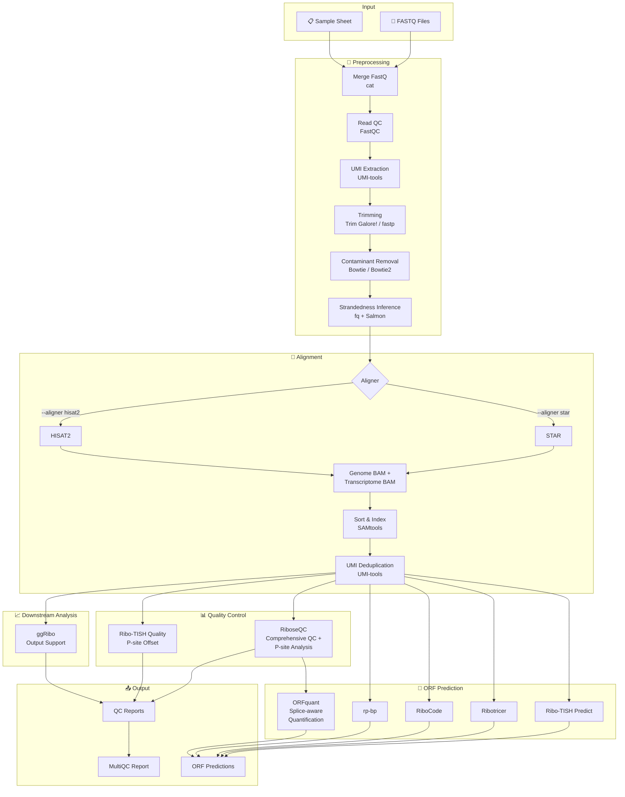

<h1>
  <picture>
    <source media="(prefers-color-scheme: dark)" srcset="docs/images/nf-core-riboseq_logo_dark.png">
    
  </picture>
</h1>

[](https://github.com/nf-core/riboseq/actions/workflows/ci.yml)
[](https://github.com/nf-core/riboseq/actions/workflows/linting.yml)[](https://nf-co.re/riboseq/results)[](https://doi.org/10.5281/zenodo.10966364)
[](https://www.nf-test.com)

[](https://www.nextflow.io/)
[](https://docs.conda.io/en/latest/)
[](https://www.docker.com/)
[](https://sylabs.io/docs/)
[](https://cloud.seqera.io/launch?pipeline=https://github.com/nf-core/riboseq)

[](https://nfcore.slack.com/channels/riboseq)[](https://twitter.com/nf_core)[](https://mstdn.science/@nf_core)[](https://www.youtube.com/c/nf-core)

## Introduction

**nf-core/riboseq** is a bioinformatics pipeline for analysis of Ribo-seq data. It borrows heavily from nf-core/rnaseq in the preprocessing stages.

### Pipeline Overview



### Preprocessing Steps

1. Merge re-sequenced FastQ files ([`cat`](http://www.linfo.org/cat.html))
2. Sub-sample FastQ files and auto-infer strandedness ([`fq`](https://github.com/stjude-rust-labs/fq), [`Salmon`](https://combine-lab.github.io/salmon/))
3. Read QC ([`FastQC`](https://www.bioinformatics.babraham.ac.uk/projects/fastqc/))
4. UMI extraction ([`UMI-tools`](https://github.com/CGATOxford/UMI-tools))
5. Adapter and quality trimming ([`Trim Galore!`](https://github.com/FelixKrueger/TrimGalore) or [`fastp`](https://github.com/OpenGene/fastp))
6. Removal of ribosomal/contaminant reads ([`Bowtie`](http://bowtie-bio.sourceforge.net/index.shtml) or [`Bowtie2`](http://bowtie-bio.sourceforge.net/bowtie2/index.shtml))
7. Genome alignment with [`STAR`](https://github.com/alexdobin/STAR) or [`HISAT2`](http://daehwankimlab.github.io/hisat2/), outputting both genome and transcriptome alignments
8. Sort and index alignments ([`SAMtools`](https://sourceforge.net/projects/samtools/files/samtools/))
9. UMI-based deduplication ([`UMI-tools`](https://github.com/CGATOxford/UMI-tools))

### Ribo-seq Quality Control

1. **RiboseQC**: Comprehensive quality control including read length distribution, P-site analysis, metagene profiles, codon periodicity, and frame bias ([`RiboseQC`](https://github.com/ohlerlab/RiboseQC))
2. **Ribo-TISH Quality**: Check reads distribution around annotated protein coding regions, show frame bias and estimate P-site offset ([`Ribo-TISH`](https://github.com/zhpn1024/ribotish))
3. **ggRibo Output**: Generates compatible output files for visualization with the [`ggRibo`](https://github.com/hsinyenwu/ggRibo) R package.

> [!IMPORTANT]
> **Design specification (development note): QC and filtering policy**
>
> The pipeline is evolving to support a strict separation between **QC** and **sORF prediction inputs**:
>
> - **RiboseQC is applied only to samples with `type=riboseq`.**
> - The pipeline will run the **QC suite twice** on `type=riboseq` samples:
>   - **Pre-filter QC** on *unfiltered* genome BAMs (for baseline QC and comparability).
>   - **Post-filter QC** on *filtered* genome BAMs (to assess the effect of filtering).
> - All **sORF prediction tools** (e.g. Ribo-TISH predict, Ribotricer, rp-bp, and any future sORF predictors integrated into the pipeline) are expected to consume **filtered BAMs only**, to ensure consistent inputs across tools.
> - Unfiltered BAMs are still retained to enable downstream quantification modules (planned), e.g. CDS-based read counting and DE analysis.

### ORF Prediction Tools

1. **Ribo-TISH** (default): Predict translated ORFs and translation initiation sites _de novo_ from alignment data ([`Ribo-TISH`](https://github.com/zhpn1024/ribotish))
2. **Ribotricer** (default): Derive candidate ORFs from reference data and detect translated ORFs ([`Ribotricer`](https://github.com/smithlabcode/ribotricer))
3. **RiboCode** (optional): Detect actively translating ORFs using transcriptome-aligned reads ([`RiboCode`](https://github.com/xztcwang/RiboCode))
4. **rp-bp** (optional): Ribosome profiling with Bayesian predictions for translated ORFs ([`rp-bp`](https://github.com/dieterich-lab/rp-bp))
5. **ORFquant** (default, requires RiboseQC): Splice-aware ORF detection and quantification at the single-ORF level ([`ORFquant`](https://github.com/lcalviell/ORFquant))

> [!IMPORTANT]
> **Design specification (development note): per-sample prediction only**
>
> Some sORF tools support a pooled / all-samples mode. When running large cohorts, pooled prediction can make runtime and memory difficult to control.
>
> - The pipeline design will therefore keep **only per-sample sORF prediction**.
> - Any pooled(all-samples) prediction runs will be **disabled/removed**.
> - Cross-sample merging/aggregation of per-sample predictions is expected to be handled by downstream user scripts.
> - The pipeline will retain sufficient intermediate outputs (per-sample result files and shared reference artefacts such as candidate ORFs where applicable) to make post-hoc merging feasible.

## Usage

> [!NOTE]
> If you are new to Nextflow and nf-core, please refer to [this page](https://nf-co.re/docs/usage/installation) on how to set-up Nextflow. Make sure to [test your setup](https://nf-co.re/docs/usage/introduction#how-to-run-a-pipeline) with `-profile test` before running the workflow on actual data.

First, prepare a samplesheet with your input data that looks as follows:

`samplesheet.csv`:

```csv
sample,fastq_1,fastq_2,strandedness,type
CONTROL_REP1,AEG588A1_S1_L002_R1_001.fastq.gz,AEG588A1_S1_L002_R2_001.fastq.gz,forward,riboseq
```

Each row represents a fastq file (single-end) or a pair of fastq files (paired end). Each row should have a 'type' value of `riboseq`, `tiseq` or `rnaseq`. Future iterations of the workflow will conduct paired analysis of matched riboseq and rnaseq samples to accomplish analysis types such as 'translational efficiency, but in the current version you should set this to `riboseq` or `tiseq` for reglar Ribo-seq or TI-seq data respectively.

### Starting from BAM Files

If you already have aligned BAM files (genome-aligned), you can skip preprocessing and alignment by providing BAM input:

`samplesheet_bam.csv`:

```csv
sample,bam,bam_index,strandedness,type
CONTROL_REP1,/path/to/sample1.bam,/path/to/sample1.bam.bai,forward,riboseq
CONTROL_REP2,/path/to/sample2.bam,,forward,riboseq
```

> [!NOTE]
> **BAM Input Mode:**
> - Provide genome-aligned BAM files (not transcriptome BAM)
> - The `bam_index` column is optional - if not provided, the pipeline will generate the index automatically
> - `strandedness` must be explicitly specified (`forward`, `reverse`, or `unstranded`) - `auto` is not supported
> - UMI deduplication and RiboCode are automatically skipped in BAM input mode
> - All samples in a samplesheet must be the same type (all FASTQ or all BAM)

> [!NOTE]
> **Planned behaviour (sORF filtering + QC before/after):**
> - Genome BAMs will be coordinate-sorted and indexed if required.
> - For `type=riboseq` samples, the pipeline will run **RiboseQC (and other riboseq QC steps)** on the **unfiltered** BAM first.
> - The pipeline will then create a **filtered BAM** used for **all sORF prediction tools**.
> - For `type=riboseq` samples, the pipeline will also run the same QC steps again on the **filtered** BAM.

Now, you can run the pipeline using:

```bash
nextflow run nf-core/riboseq \
   -profile <docker/singularity/.../institute> \
   --input samplesheet.csv \
   --outdir <OUTDIR>
```

### Choosing an Aligner

The pipeline supports two aligners:

- **STAR** (default): `--aligner star`
- **HISAT2**: `--aligner hisat2`

Both aligners produce genome and transcriptome alignments. Pre-built indexes can be provided using:

```bash
# For STAR
--star_index /path/to/star/index

# For HISAT2
--hisat2_index /path/to/hisat2/genome/index
```

> [!NOTE]
> The HISAT2 transcriptome index is always auto-built from your GTF/FASTA to ensure compatibility.

### Selecting ORF Prediction Tools

By default, the pipeline runs Ribo-TISH, Ribotricer, RiboseQC, and ORFquant. Additional tools can be enabled:

```bash
# Enable RiboCode (requires STAR or HISAT2 transcriptome alignments)
--run_ribocode

# Enable rp-bp (requires contaminant FASTA)
--run_rpbp --contaminant_fasta /path/to/contaminants.fa
```

To skip specific tools:

```bash
--skip_ribotish
--skip_ribotricer
--skip_riboseqc
--skip_orfquant    # Note: ORFquant requires RiboseQC, skipping RiboseQC will also skip ORFquant
```

> [!NOTE]
> **ORFquant** uses the P-site analysis output from **RiboseQC** (`*_for_ORFquant` files). If you skip RiboseQC, ORFquant will also be automatically skipped.

### sORF BAM filtering (design specification)

To ensure consistent inputs across sORF prediction tools, the pipeline design includes an explicit BAM filtering step applied *after* alignment (and optional UMI deduplication) and *after* a first round of riboseq QC.

Filtering rules (applied to genome-aligned BAMs):

1. **Unique mapping reads only**
    - Strategy is configurable; preferred is an `NH:i:1`-based check when the tag is present.
    - A MAPQ-based strategy can be used as a fallback when `NH` is unavailable.
    - Duplicate-marked reads (SAM flag `0x400`) are removed.
2. **Exclude reads aligned to unwanted reference contigs**
    - Intended to drop alignments to mitochondrial / chloroplast contigs and ambiguous scaffolds.
    - Implemented via a configurable contig-name regex (or explicit allow/deny list), derived from the reference `*.fai`.
    - **Species-specific naming note:**
        - Animals (e.g. Gencode human/mouse) commonly use `chrM` / `MT` for mitochondria and may include unlocalized/alternative contigs such as `chrUn_*`, `*_random`, `*_alt`, `*_fix`.
        - Plants (e.g. Ensembl Plants rice/maize) commonly use `Mt` (mitochondrion) and `Pt` (plastid/chloroplast), and may include numerous scaffold/unanchored contigs depending on the assembly.
        - If your reference uses different names, override `--sorf_exclude_contigs_regex` in your run config.
3. **Read length filter**
    - Keep reads whose sequence length falls within a configurable interval.
    - Default interval: **28–30 nt**.

Planned parameters (names may change slightly as implementation lands):

- `--sorf_filter` (bool): Enable/disable the sORF BAM filtering step.
- `--sorf_read_len_min` (int, default `28`)
- `--sorf_read_len_max` (int, default `30`)
- `--sorf_exclude_contigs_regex` (string): Regex for contigs to exclude (e.g. mitochondria/chloroplast/ambiguous scaffolds).
- `--sorf_unique_mode` (`auto|nh|mapq`): How to enforce unique mapping.
- `--sorf_unique_mapq` (int): MAPQ threshold used when `--sorf_unique_mode` requires MAPQ.
- `--sorf_predict_pooled` (bool, default `false`): Whether to run pooled(all-samples) sORF prediction in addition to per-sample prediction.

Example contig exclusion regex presets (copy/paste and customize):

- **Animals (Gencode human/mouse; UCSC-style contigs)**
    - Typical mitochondria: `chrM` / `MT`
    - Typical ambiguous/unlocalized contigs: `chrUn_*`, `*_random`, `*_alt`, `*_fix`
    - Suggested preset:
        - `--sorf_exclude_contigs_regex '^(chr)?(M|MT|chrM|chrMT|ChrM|ChrMT)$|^chrUn_.*|.*_random$|.*_alt$|.*_fix$'`

- **Plants (Ensembl Plants rice/maize; organelle contigs commonly Mt/Pt)**
    - Typical mitochondrion: `Mt` (sometimes also `chrMt`)
    - Typical plastid/chloroplast: `Pt` (sometimes also `chrPt`)
    - Suggested preset (keep the scaffold patterns if your assembly includes them):
        - `--sorf_exclude_contigs_regex '^(chr)?(Mt|chrMt|ChrMt)$|^(chr)?(Pt|chrPt|ChrPt)$|^chrUn_.*|.*_random$|.*_alt$|.*_fix$'`

> [!NOTE]
> Species-specific configuration logic: the pipeline cannot reliably infer organelle / scaffold contigs across all assemblies. Defaults aim to cover common cases, but for non-Gencode/Ensembl references you should explicitly set `--sorf_exclude_contigs_regex` based on your FASTA headers / `*.fai`.

> [!NOTE]
> The filtering step is intended to apply to both FASTQ and BAM input modes, and to affect only the BAMs passed into sORF prediction tools. Unfiltered BAMs remain available for QC baselines and planned quantification modules.

> [!WARNING]
> Please provide pipeline parameters via the CLI or Nextflow `-params-file` option. Custom config files including those provided by the `-c` Nextflow option can be used to provide any configuration _**except for parameters**_; see [docs](https://nf-co.re/docs/usage/getting_started/configuration#custom-configuration-files).

For more details and further functionality, please refer to the [usage documentation](https://nf-co.re/riboseq/usage) and the [parameter documentation](https://nf-co.re/riboseq/parameters).

## Pipeline output

To see the results of an example test run with a full size dataset refer to the [results](https://nf-co.re/riboseq/results) tab on the nf-core website pipeline page.
For more details about the output files and reports, please refer to the
[output documentation](https://nf-co.re/riboseq/output).

## Credits

nf-core/riboseq was originally written by [Jonathan Manning](https://github.com/pinin4fjords) (Bioinformatics Engineer at Seqera) with support from [Altos Labs](https://www.altoslabs.com/) and in discussion with [Felix Krueger](https://github.com/FelixKrueger) and [Christel Krueger](https://github.com/ChristelKrueger). We thank the following people for their input:

- Anne Bresciani (ZS)
- [Felipe Almeida](https://github.com/fmalmeida) (ZS)
- [Mikhail Osipovitch](https://github.com/mosi223) (ZS)
- [Edward Wallace](https://github.com/ewallace) (University of Edinburgh)
- [Jack Tierney](https://github.com/JackCurragh) (University College Cork)
- [Maxime U Garcia](https://github.com/maxulysse) (Seqera)

## Contributions and Support

If you would like to contribute to this pipeline, please see the [contributing guidelines](.github/CONTRIBUTING.md).

For further information or help, don't hesitate to get in touch on the [Slack `#riboseq` channel](https://nfcore.slack.com/channels/riboseq) (you can join with [this invite](https://nf-co.re/join/slack)).

## Citations

If you use nf-core/riboseq for your analysis, please cite it using the following doi: [10.5281/zenodo.10966364](https://doi.org/10.5281/zenodo.10966364)

An extensive list of references for the tools used by the pipeline can be found in the [`CITATIONS.md`](CITATIONS.md) file.

You can cite the `nf-core` publication as follows:

> **The nf-core framework for community-curated bioinformatics pipelines.**
>
> Philip Ewels, Alexander Peltzer, Sven Fillinger, Harshil Patel, Johannes Alneberg, Andreas Wilm, Maxime Ulysse Garcia, Paolo Di Tommaso & Sven Nahnsen.
>
> _Nat Biotechnol._ 2020 Feb 13. doi: [10.1038/s41587-020-0439-x](https://dx.doi.org/10.1038/s41587-020-0439-x).
