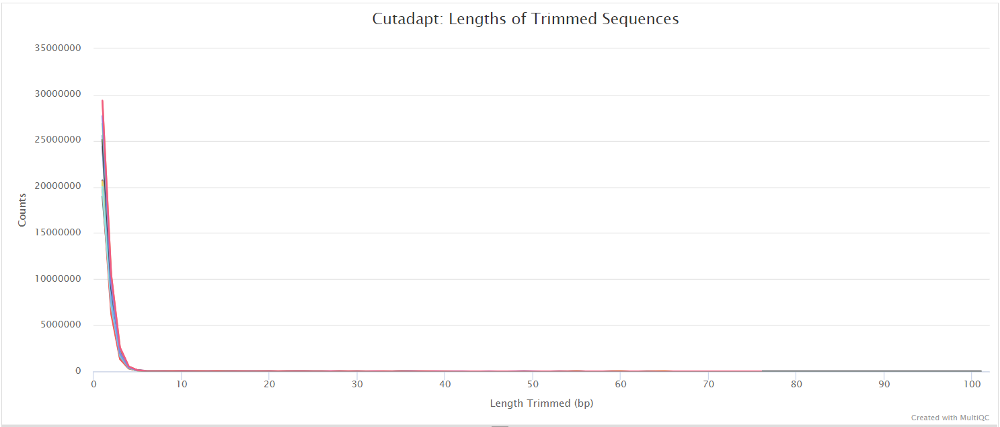
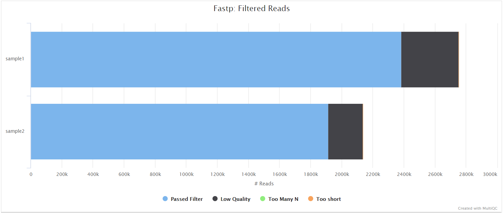
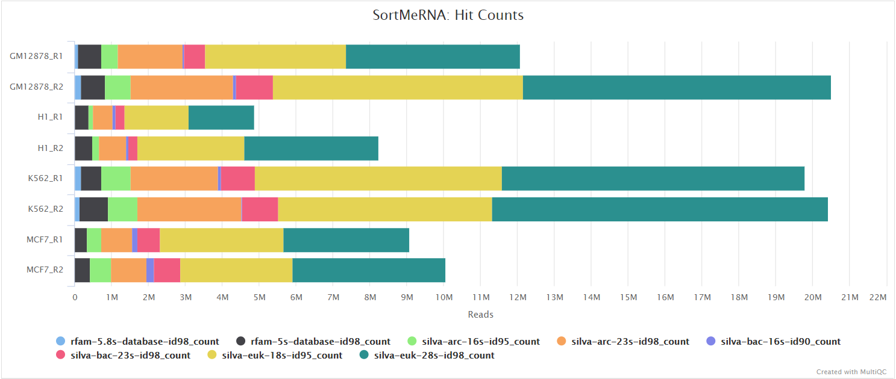
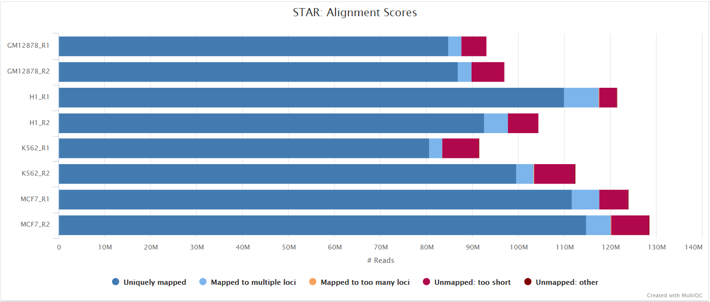
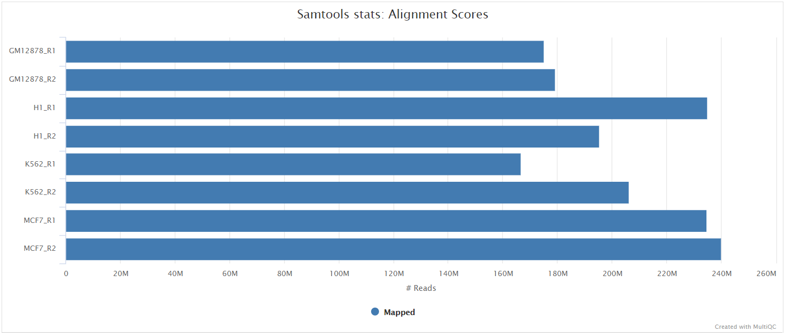
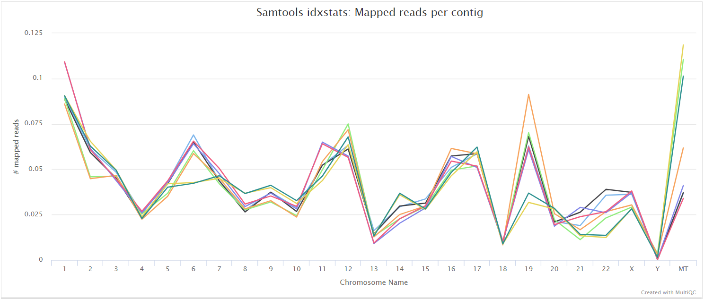

# nf-core/riboseq: Output

## Introduction

This document describes the output produced by the pipeline. Most of the plots are taken from the MultiQC report generated from the [full-sized test dataset](https://github.com/nf-core/test-datasets/tree/riboseq#full-test-dataset-origin) for the pipeline using a command similar to the one below:

```bash
nextflow run nf-core/riboseq -profile test_full,<docker/singularity/institute>
```

The directories listed below will be created in the results directory after the pipeline has finished. All paths are relative to the top-level results directory.

## Pipeline overview

The pipeline is built using [Nextflow](https://www.nextflow.io/) and processes data using the following steps:

- [nf-core/riboseq: Output](#nf-coreriboseq-output)
  - [Introduction](#introduction)
  - [Pipeline overview](#pipeline-overview)
  - [Output directory layout (redesigned)](#output-directory-layout-redesigned)
  - [Preprocessing](#preprocessing)
    - [cat](#cat)
    - [fq lint](#fq-lint)
    - [FastQC](#fastqc)
    - [UMI-tools extract](#umi-tools-extract)
    - [TrimGalore](#trimgalore)
    - [fastp](#fastp)
    - [BBSplit](#bbsplit)
    - [SortMeRNA](#sortmerna)
    - [Strandedness inference with Salmon](#strandedness-inference-with-salmon)
  - [Alignment](#alignment)
    - [STAR](#star)
    - [UMI dedup](#umi-dedup)
  - [Riboseq-specific QC](#riboseq-specific-qc)
    - [Ribo-TISH quality](#ribo-tish-quality)
    - [RiboseQC](#riboseqc)
    - [Ribotricer detect-orfs QC outputs](#ribotricer-detect-orfs-qc-outputs)
  - [ORF predictions](#orf-predictions)
    - [Ribo-TISH predict](#ribo-tish-predict)
    - [Ribotricer detect-orfs](#ribotricer-detect-orfs)
    - [Unified ORF predictions (experimental)](#unified-orf-predictions-experimental)
    - [ORF classification (experimental)](#orf-classification-experimental)
  - [Quantification](#quantification)
  - [Translational efficiency](#translational-efficiency)
    - [MultiQC](#multiqc)
  - [Workflow reporting and genomes](#workflow-reporting-and-genomes)
    - [Reference genome files](#reference-genome-files)
    - [Pipeline information](#pipeline-information)

## Output directory layout (redesigned)

The pipeline currently publishes outputs across several top-level folders. For clarity, we recommend a **logical** layout that groups results by analysis domain (the actual publish paths remain as described in each section below unless explicitly reconfigured):

```
results/
  genome/
  preprocessing/
  alignment/
  riboseq_qc/
  orf_predictions/
  orf_unification/
  orf_classification/
  quantification/
  translational_efficiency/
  multiqc/
  pipeline_info/
```

This layout keeps **ORF prediction**, **unification**, and **classification** outputs together while preserving the existing QC and quantification separation. Detailed file descriptions are listed in the corresponding sections below.

## Preprocessing

### cat

<details markdown="1">
<summary>Output files</summary>

- `preprocessing/fastq/`
  - `*.merged.fastq.gz`: If `--save_merged_fastq` is specified, concatenated FastQ files will be placed in this directory.

</details>

If multiple libraries/runs have been provided for the same sample in the input samplesheet (e.g. to increase sequencing depth) then these will be merged at the very beginning of the pipeline in order to have consistent sample naming throughout the pipeline. Please refer to the [usage documentation](https://nf-co.re/riboseq/usage#samplesheet-input) to see how to specify these samples in the input samplesheet.

### fq lint

<details markdown="1">
<summary>Output files</summary>

- `fq_lint/*`
  - `*.fq_lint.txt`: Linting report per library from `fq lint`.

> **NB:** You will see subdirectories here based on the stage of preprocessing for the files that have been linted, for example `raw`, `trimmed`.

</details>

[fq lint](https://github.com/stjude-rust-labs/fq) runs several checks on input FASTQ files. It will fail with a non-zero error code when issues are found, which will terminate the workflow execution. In the absence of this, the successful linting produces the logs you will find here.

### FastQC

<details markdown="1">
<summary>Output files</summary>

- `preprocessing/fastqc/`
  - `*_fastqc.html`: FastQC report containing quality metrics.
  - `*_fastqc.zip`: Zip archive containing the FastQC report, tab-delimited data file and plot images.

> **NB:** The FastQC plots in this directory are generated relative to the raw, input reads. They may contain adapter sequence and regions of low quality. To see how your reads look after adapter and quality trimming please refer to the FastQC reports in the `trimgalore/fastqc/` directory.

</details>

[FastQC](http://www.bioinformatics.babraham.ac.uk/projects/fastqc/) gives general quality metrics about your sequenced reads. It provides information about the quality score distribution across your reads, per base sequence content (%A/T/G/C), adapter contamination and overrepresented sequences. For further reading and documentation see the [FastQC help pages](http://www.bioinformatics.babraham.ac.uk/projects/fastqc/Help/).


### UMI-tools extract

<details markdown="1">
<summary>Output files</summary>

- `umitools/`
  - `*.fastq.gz`: If `--save_umi_intermeds` is specified, FastQ files **after** UMI extraction will be placed in this directory.
  - `*.log`: Log file generated by the UMI-tools `extract` command.

</details>

[UMI-tools](https://github.com/CGATOxford/UMI-tools) and [UMICollapse](https://github.com/Daniel-Liu-c0deb0t/UMICollapse) deduplicate reads based on unique molecular identifiers (UMIs) to address PCR-bias. Firstly, the UMI-tools `extract` command removes the UMI barcode information from the read sequence and adds it to the read name. Secondly, reads are deduplicated based on UMI identifier after mapping as highlighted in the [UMI dedup](#umi-dedup) section.

To facilitate processing of input data which has the UMI barcode already embedded in the read name from the start, `--skip_umi_extract` can be specified in conjunction with `--with_umi`.

### TrimGalore

<details markdown="1">
<summary>Output files</summary>

- `preprocessing/trimgalore/`
  - `*.fq.gz`: If `--save_trimmed` is specified, FastQ files **after** adapter trimming will be placed in this directory.
  - `*_trimming_report.txt`: Log file generated by Trim Galore!.
- `preprocessing/trimgalore/fastqc/`
  - `*_fastqc.html`: FastQC report containing quality metrics for read 1 (_and read2 if paired-end_) **after** adapter trimming.
  - `*_fastqc.zip`: Zip archive containing the FastQC report, tab-delimited data file and plot images.

</details>

[Trim Galore!](https://www.bioinformatics.babraham.ac.uk/projects/trim_galore/) is a wrapper tool around Cutadapt and FastQC to peform quality and adapter trimming on FastQ files. Trim Galore! will automatically detect and trim the appropriate adapter sequence. It is the default trimming tool used by this pipeline, however you can use fastp instead by specifying the `--trimmer fastp` parameter. You can specify additional options for Trim Galore! via the `--extra_trimgalore_args` parameters.

> **NB:** TrimGalore! will only run using multiple cores if you are able to use more than > 5 and > 6 CPUs for single- and paired-end data, respectively. The total cores available to TrimGalore! will also be capped at 4 (7 and 8 CPUs in total for single- and paired-end data, respectively) because there is no longer a run-time benefit. See [release notes](https://github.com/FelixKrueger/TrimGalore/blob/master/Changelog.md#version-060-release-on-1-mar-2019) and [discussion whilst adding this logic to the nf-core/atacseq pipeline](https://github.com/nf-core/atacseq/pull/65).



### fastp

<details markdown="1">
<summary>Output files</summary>

- `preprocessing/fastp/`
  - `*.fastq.gz`: If `--save_trimmed` is specified, FastQ files **after** adapter trimming will be placed in this directory.
  - `*.fastp.html`: Trimming report in html format.
  - `*.fastp.json`: Trimming report in json format.
- `preprocessing/fastp/log/`
  - `*.fastp.log`: Trimming log file.
- `preprocessing/fastp/fastqc/`
  - `*_fastqc.html`: FastQC report containing quality metrics for read 1 (_and read2 if paired-end_) **after** adapter trimming.
  - `*_fastqc.zip`: Zip archive containing the FastQC report, tab-delimited data file and plot images.

</details>

[fastp](https://github.com/OpenGene/fastp) is a tool designed to provide fast, all-in-one preprocessing for FastQ files. It has been developed in C++ with multithreading support to achieve higher performance. fastp can be used in this pipeline for standard adapter trimming and quality filtering by setting the `--trimmer fastp` parameter. You can specify additional options for fastp via the `--extra_fastp_args` parameter.



### BBSplit

<details markdown="1">
<summary>Output files</summary>

- `preprocessing/bbsplit/`
  - `*.fastq.gz`: If `--save_bbsplit_reads` is specified FastQ files split by reference will be saved to the results directory. Reads from the main reference genome will be named "_primary_.fastq.gz". Reads from contaminating genomes will be named "_<SHORT_NAME>_.fastq.gz" where `<SHORT_NAME>` is the first column in `--bbsplit_fasta_list` that needs to be provided to initially build the index.
  - `*.txt`: File containing statistics on how many reads were assigned to each reference.

</details>

[BBSplit](http://seqanswers.com/forums/showthread.php?t=41288) is a tool that bins reads by mapping to multiple references simultaneously, using BBMap. The reads go to the bin of the reference they map to best. There are also disambiguation options, such that reads that map to multiple references can be binned with all of them, none of them, one of them, or put in a special "ambiguous" file for each of them.

This functionality would be especially useful, for example, if you have [mouse PDX](https://en.wikipedia.org/wiki/Patient_derived_xenograft) samples that contain a mixture of human and mouse genomic DNA/RNA and you would like to filter out any mouse derived reads.

The BBSplit index will have to be built at least once with this pipeline by providing [`--bbsplit_fasta_list`](https://nf-co.re/riboseq/parameters#bbsplit_fasta_list) which has to be a file containing 2 columns: short name and full path to reference genome(s):

```bash
mm10,/path/to/mm10.fa
ecoli,/path/to/ecoli.fa
sarscov2,/path/to/sarscov2.fa
```

You can save the index by using the [`--save_reference`](https://nf-co.re/riboseq/parameters#save_reference) parameter and then provide it via [`--bbsplit_index`](https://nf-co.re/riboseq/parameters#bbsplit_index) for future runs. As described in the `Output files` dropdown box above the FastQ files relative to the main reference genome will always be called `*primary*.fastq.gz`.

### SortMeRNA

<details markdown="1">
<summary>Output files</summary>

- `preprocessing/sortmerna/`
  - `*.fastq.gz`: If `--save_non_ribo_reads` is specified, FastQ files containing non-rRNA reads will be placed in this directory.
  - `*.log`: Log file generated by SortMeRNA with information regarding reads that matched the reference database(s).

</details>

When `--remove_ribo_rna` is specified, the pipeline uses [SortMeRNA](https://github.com/biocore/sortmerna) for the removal of ribosomal RNA. By default, [rRNA databases](https://github.com/biocore/sortmerna/tree/master/data/rRNA_databases) defined in the SortMeRNA GitHub repo are used. You can see an example in the pipeline Github repository in `assets/rrna-default-dbs.txt` which is used by default via the `--ribo_database_manifest` parameter. Please note that commercial/non-academic entities require [`licensing for SILVA`](https://www.arb-silva.de/silva-license-information) for these default databases.



### Strandedness inference with Salmon

> **Important**: Salmon is used in this pipeline **only for strandedness inference**, not for quantification. When sample strandedness is set to `auto` in the samplesheet, the pipeline uses Salmon to automatically detect the library strandedness by aligning a subsample of reads to the transcriptome. This information is then used to configure downstream alignment and analysis tools correctly. The Salmon quantification outputs from this step are not published as they are based on subsampled reads and should not be used for downstream analysis.

## Alignment

### STAR

<details markdown="1">
<summary>Output files</summary>

- `alignment/star/original`
  - `*.Aligned.out.bam`: If `--save_align_intermeds` is specified the original BAM file containing read alignments to the reference genome will be placed in this directory.
  - `*.Aligned.toTranscriptome.out.bam`: If `--save_align_intermeds` is specified the original BAM file containing read alignments to the transcriptome will be placed in this directory.
- `alignment/star/sorted`
  - `*.genome.sorted.bam`: Coordinate-sorted genome BAM file for each sample
  - `*.genome.sorted.bam.bai`: Index for coordinate-sorted genome BAM file for each sample
  - `*.transcriptome.sorted.bam`: Coordinate-sorted transcriptome BAM file for each sample
  - `*.transcriptome.sorted.bam.bai`: Index for coordinate-sorted transcriptome BAM file for each sample
- `alignment/star/log/`
  - `*.SJ.out.tab`: File containing filtered splice junctions detected after mapping the reads.
  - `*.Log.final.out`: STAR alignment report containing the mapping results summary.
  - `*.Log.out` and `*.Log.progress.out`: STAR log files containing detailed information about the run. Typically only useful for debugging purposes.
- `alignment/star/unmapped/`
  - `*.fastq.gz`: If `--save_unaligned` is specified, FastQ files containing unmapped reads will be placed in this directory.
- `alignment/star/sorted/samtools_stats/`
  - SAMtools `*.sorted.bam.flagstat`, `*.sorted.bam.idxstats` and `*.sorted.bam.stats` files generated from the sorted alignment files.

</details>

[STAR](https://github.com/alexdobin/STAR) is a read aligner designed for splice aware mapping typical of RNA sequencing data. STAR stands for *S*pliced *T*ranscripts *A*lignment to a *R*eference, and has been shown to have high accuracy and outperforms other aligners by more than a factor of 50 in mapping speed, but it is memory intensive. Using `--aligner star_salmon` is the default alignment and quantification option.

The STAR section of the MultiQC report shows a bar plot with alignment rates: good samples should have most reads as _Uniquely mapped_ and few _Unmapped_ reads.



The original BAM files generated by the selected alignment algorithm are further processed with [SAMtools](http://samtools.sourceforge.net/) to sort them by coordinate, for indexing, as well as to generate read mapping statistics.





### UMI dedup

<details markdown="1">
<summary>Output files</summary>

- `alignment/star/deduplicated`
  - `<SAMPLE>.umi_dedup.sorted.bam`: If `--save_umi_intermeds` is specified the UMI deduplicated, coordinate sorted BAM file containing read alignments will be placed in this directory.
  - `<SAMPLE>.umi_dedup.sorted.bam.bai`: If `--save_umi_intermeds` is specified the BAI index file for the UMI deduplicated, coordinate sorted BAM file will be placed in this directory.
  - `<SAMPLE>.umi_dedup.sorted.bam.csi`: If `--save_umi_intermeds --bam_csi_index` is specified the CSI index file for the UMI deduplicated, coordinate sorted BAM file will be placed in this directory.
- `alignment/star/deduplicated/log/`
  - `*_edit_distance.tsv`: Reports the (binned) average edit distance between the UMIs at each position (UMI-tools only).
  - `*_per_umi.tsv`: UMI-level summary statistics (UMI-tools only).
  - `*_per_umi_per_position.tsv`: Tabulates the counts for unique combinations of UMI and position (UMI-tools only).
  - `*.log`: log from UMI deduplication tool.

The content of the files above is explained in more detail in the [UMI-tools documentation](https://umi-tools.readthedocs.io/en/latest/reference/dedup.html#dedup-specific-options).

</details>

After extracting the UMI information from the read sequence (see [UMI-tools extract](#umi-tools-extract)), the second step in the removal of UMI barcodes involves deduplicating the reads based on both mapping and UMI barcode information. UMI deduplication can be carried out either with [UMI-tools](https://github.com/CGATOxford/UMI-tools) or [UMICollapse](https://github.com/Daniel-Liu-c0deb0t/UMICollapse), set via the `umi_dedup_tool` parameter. The output BAM files are the same, though UMI-tools has some additional outputs, as described above. Either method will generate a filtered BAM file after the removal of PCR duplicates.

## Riboseq-specific QC

Read distribution metrics around annotated protein coding regions or based on alignments alone, plus related metrics.

### Ribo-TISH quality

<details markdown="1">
<summary>Output files</summary>

- `riboseq_qc/ribotish/`
  - `*_qual.txt`: text-format data on read distribution around annotated protein coding regions on user provided transcripts
  - `*_qual.pdf`: PDF-format representation of read distribution around annotated protein coding regions on user provided transcripts
  - `*.para.py`: P-site offsets for different reads lengths in python code dict format
  </details>

### RiboseQC

[RiboseQC](https://github.com/ohlerlab/RiboseQC) is a comprehensive quality control tool for Ribo-seq data that provides detailed analysis of ribosome profiling experiments. It generates P-site offset calculations, coverage profiles, and various QC metrics. Results are organized by filter status:

<details markdown="1">
<summary>Output files</summary>

- `riboseq_qc/annotation/`
  - `*_Rannot`: RiboseQC annotation file generated from GTF and genome FASTA, used for all samples.

- `riboseq_qc/riboseqc/prefilter/`
  - `*_results_RiboseQC`: Core QC results (using unfiltered BAMs with MT reads).
  - `*_results_RiboseQC_all`: Complete results file with detailed analysis data.
  - `*_for_ORFquant`: ORFquant-compatible output file.
  - `*_coverage_*.bedgraph`: Read coverage files (plus/minus strands, unique/all reads).
  - `*_P_sites_*.bedgraph`: P-site position files (plus/minus strands, unique/all reads).
  - `*_P_sites_calcs`: P-site offset calculations for different read lengths.
  - `*_junctions`: Splice junction information from ribosome footprints.

- `riboseq_qc/riboseqc/postfilter/`
  - `*_results_RiboseQC`: Core QC results (using filtered BAMs, MT reads removed).
  - `*_results_RiboseQC_all`: Complete results file with detailed analysis data.
  - `*_for_ORFquant`: ORFquant-compatible output file (used by ORFquant for ORF detection).
  - `*_coverage_*.bedgraph`: Read coverage files (plus/minus strands, unique/all reads).
  - `*_P_sites_*.bedgraph`: P-site position files (plus/minus strands, unique/all reads).
  - `*_P_sites_calcs`: P-site offset calculations for different read lengths.
  - `*_junctions`: Splice junction information from ribosome footprints.

</details>

**Filter Status:**
- **prefilter/**: Results from unfiltered BAMs (includes MT/chrM reads, used for QC comparison)
- **postfilter/**: Results from filtered BAMs (MT reads removed, read length 28-30, unique mapping only) - **used for ORFquant**

> **Note**: HTML report generation is currently disabled due to compatibility issues with the containerized RiboseQC environment. The core QC results in `*_results_RiboseQC` files contain all essential quality metrics.

### Ribotricer detect-orfs QC outputs

<details markdown="1">
<summary>Output files</summary>

- `riboseq_qc/ribotricer/`
  - `*_read_length_dist.pdf`: PDF-format read length distribution as quality control
  - `*_metagene_plots.pdf`: Metagene plots for quality control
  - `*_protocol.txt`: txt file containing inferred protocol if it was inferred (not supplied as input)
  - `*_metagene_profiles_5p.tsv`: Metagene profile aligning with the start codon
  - `*_metagene_profiles_3p.tsv`: Metagene profile aligning with the stop codon
  </details>

## ORF predictions

### Ribo-TISH predict

Ribo-TISH (Translating Initiation Site Hunter) predicts translation initiation sites (TIS) and ORFs from ribosome profiling data. Results are organized by filter status:

<details markdown="1">
<summary>Output files</summary>

- `orf_predictions/ribotish/prefilter/`
  - `*_pred.txt` thresholded ORF predictions (using unfiltered BAMs with MT reads)
  - `*_all.txt` unthresholded ORF predictions (using unfiltered BAMs with MT reads)
  - `*_transprofile.py` RPF P-site profile for each transcript
- `orf_predictions/ribotish/postfilter/`
  - `*_pred.txt` thresholded ORF predictions (using filtered BAMs, MT reads removed)
  - `*_all.txt` unthresholded ORF predictions (using filtered BAMs, MT reads removed)
  - `*_transprofile.py` RPF P-site profile for each transcript
- `orf_predictions/ribotish_all/postfilter/`
  - `allsamples_pred.txt` thresholded ORF predictions from Ribo-TISH ran over all samples at once (using filtered BAMs)
  - `allsamples_all.txt` unthresholded ORF predictions from Ribo-TISH ran over all samples at once
  - `allsamples_transprofile.py` RPF P-site profile for each transcript ran over all samples at once
  </details>

**Filter Status:**
- **prefilter/**: Results from unfiltered BAMs (includes MT/chrM reads, used for QC comparison)
- **postfilter/**: Results from filtered BAMs (MT reads removed, read length 28-30, unique mapping only) - **recommended for ORF calling**

> **Note**: By default, only **postfilter** analysis is performed to save computational resources. To also generate **prefilter** QC results for comparison purposes, run with `--run_prefilter_qc` flag.

### Ribotricer detect-orfs

Ribotricer detects actively translating ORFs using ribosome profiling data. Results are organized by filter status:

<details markdown="1">
<summary>Output files</summary>

- `orf_predictions/ribotricer/prefilter/`
  - `*_translating_ORFs.tsv` TSV with ORFs assessed as translating (using unfiltered BAMs with MT reads)
  - `*_psite_offsets.txt` Derived relative P-site offsets (if not provided)
- `orf_predictions/ribotricer/postfilter/`
  - `*_translating_ORFs.tsv` TSV with ORFs assessed as translating (using filtered BAMs, MT reads removed)
  - `*_psite_offsets.txt` Derived relative P-site offsets (if not provided)
  </details>

**Filter Status:**
- **prefilter/**: Results from unfiltered BAMs (includes MT/chrM reads, used for QC comparison)
- **postfilter/**: Results from filtered BAMs (MT reads removed, read length 28-30, unique mapping only) - **recommended for ORF calling**

### ORFquant

ORFquant is a splice-aware ORF detection tool that integrates RiboseQC analysis results. It only runs on postfilter (MT-removed) BAMs for accurate ORF calling.

<details markdown="1">
<summary>Output files</summary>

- `orf_predictions/orfquant/postfilter/`
  - `*.gtf`: GTF file with detected ORF annotations (using filtered BAMs, MT reads removed)
  - `*_results.txt`: Detailed ORF quantification results including expression levels
  - `*_summary.txt`: Summary statistics of ORF detection

</details>

**Note**: ORFquant only runs on postfilter BAMs as it requires high-quality, MT-removed reads for accurate splice-aware ORF detection. It uses the `*_for_ORFquant` files from RiboseQC postfilter analysis.

### Unified ORF predictions (experimental)

<details markdown="1">
<summary>Output files</summary>

- `orf_unification/`
  - `unified_orfs.metadata.tsv`: Unified ORF metadata (ORF ID, sources, samples, sequence, genomic blocks)
  - `unified_orfs.bed`: Unified ORF coordinates in BED12 format
  - `unified_orfs.gtf`: Unified ORF annotations in GTF format

</details>

The unified ORF predictions are generated by merging Ribo-TISH / Ribotricer / ORFquant postfilter outputs and de-duplicating ORFs by genomic coordinates.

### ORF classification (experimental)

<details markdown="1">
<summary>Output files</summary>

- `orf_classification/`
  - `gencode/`
    - `gencode_results.orfs.out` / `gencode_results.orfs.gtf`
  - `orfquant/`
    - `orfquant_classification.tsv`
  - `orf_type/`
    - `orftype_classification.tsv`

</details>

All three classification modes run and always use the unified ORF predictions as input.

## Quantification

Quantification is done by passing transcriptome-level alignment BAM files to Salmon, producing the following outputs:

<details markdown="1">
<summary>Output files</summary>

- `quantification/`
  - `tx2gene.tsv`: Tab-delimited file containing gene to transcripts ids mappings.
- `quantification/salmon/`
  - salmon.merged.gene_counts.tsv`: Matrix of gene-level raw counts across all samples.
  - salmon.merged.gene_tpm.tsv`: Matrix of gene-level TPM values across all samples.
  - salmon.merged.gene.rds`: RDS object that can be loaded in R that contains a [SummarizedExperiment](https://bioconductor.org/packages/release/bioc/html/SummarizedExperiment.html) container with the TPM (`abundance`), estimated counts (`counts`) and transcript length (`length`) in the assays slot for genes.
  - salmon.merged.gene_counts_scaled.tsv`: Matrix of gene-level library size-scaled counts across all samples.
  - salmon.merged.gene\_\_scaled.rds`: RDS object that can be loaded in R that contains a [SummarizedExperiment](https://bioconductor.org/packages/release/bioc/html/SummarizedExperiment.html) container with the TPM (`abundance`), estimated library size-scaled counts (`counts`) and transcript length (`length`) in the assays slot for genes.
  - salmon.merged.gene_counts_length_scaled.tsv`: Matrix of gene-level length-scaled counts across all samples.
  - salmon.merged.gene_length_scaled.rds`: RDS object that can be loaded in R that contains a [SummarizedExperiment](https://bioconductor.org/packages/release/bioc/html/SummarizedExperiment.html) container with the TPM (`abundance`), estimated length-scaled counts (`counts`) and transcript length (`length`) in the assays slot for genes.
  - salmon.merged.transcript_counts.tsv`: Matrix of isoform-level raw counts across all samples.
  - salmon.merged.transcript_tpm.tsv`: Matrix of isoform-level TPM values across all samples.
  - salmon.merged.transcript.rds`: RDS object that can be loaded in R that contains a [SummarizedExperiment](https://bioconductor.org/packages/release/bioc/html/SummarizedExperiment.html) container with the TPM (`abundance`), estimated isoform-level raw counts (`counts`) and transcript length (`length`) in the assays slot for transcripts.
  </details>

Raw outputs from Salmon are available for each sample:

<details markdown="1">
<summary>Output files</summary>

- `quantification/salmon/<SAMPLE>/`
  - `aux_info/`: Auxiliary info e.g. versions and number of mapped reads.
  - `cmd_info.json`: Information about the Salmon quantification command, version and options.
  - `lib_format_counts.json`: Number of fragments assigned, unassigned and incompatible.
  - `libParams/`: Contains the file `flenDist.txt` for the fragment length distribution.
  - `logs/`: Contains the file `salmon_quant.log` giving a record of Salmon's quantification.
  - `quant.genes.sf`: Salmon _gene_-level quantification of the sample, including feature length, effective length, TPM, and number of reads.
  - `quant.sf`: Salmon _transcript_-level quantification of the sample, including feature length, effective length, TPM, and number of reads.
  </details>

## Translational efficiency

anota2seq produces the following outputs:

<details markdown="1">
<summary>Output files</summary>

- `translational_efficiency/anota2seq`
  - `*.total_mRNA.anota2seq.results.tsv`: anota2seq results for the 'total mRNA' analysis, describing differences in RNA levels across conditions for RNA-seq samples. See https://rdrr.io/bioc/anota2seq/man/anota2seqGetOutput.html for description of output columns.
  - `*.translated_mRNA.anota2seq.results.tsv`: anota2seq results for the 'translated mRNA' analysis, describing differences in RNA levels across conditions for Ribo-seq samples. See https://rdrr.io/bioc/anota2seq/man/anota2seqGetOutput.html for description of output columns.
  - `*.mRNA_abundance.anota2seq.results.tsv`: anota2seq results for the 'mRNA abunance' analysis, describing changes across conditions consistent between total mRNA and translated RNA (RNA-seq and Riboseq samples). See https://rdrr.io/bioc/anota2seq/man/anota2seqGetOutput.html for description of output columns.
  - `*.buffering.anota2seq.results.tsv`: anota2seq results for the 'buffering' analysis, describing stable levels of translated RNA (from riboseq samples) across conditions, despite changes in total mRNA. See https://rdrr.io/bioc/anota2seq/man/anota2seqGetOutput.html for description of output columns.
  - `*.translation.anota2seq.results.tsv`: anota2seq results for the 'translation' analysis, describing differences in translation across conditions, being differences in translated RNA levels not explained by total RNA levels. See https://rdrr.io/bioc/anota2seq/man/anota2seqGetOutput.html for description of output columns.
  - `*.fold_change.png`: A fold change plot in PNG format, from anota2seq's anota2seqPlotFC() method.
  - `*.interaction_p_distribution.pdf`: The distribution of p-values and adjusted p-values for the omnibus interaction (both using densities and histograms). The second page of the pdf displays the same plots but for the RVM statistics if RVM is used.
  - `*.residual_distribution_summary.jpeg`: Summary plot for assessing normal distribution of regression residuals.
  - `*.residual_vs_fitted.jpeg`: QC plot showing residuals against fitted values.
  - `*.rvm_fit_for_all_contrasts_group.jpg`: QC plot showing the CDF of variance (theoretical vs empirical), all contrasts.
  - `*.rvm_fit_for_interactions.jpg`: QC plot showing the CDF of variance (theoretical vs empirical), for interactions.
  - `*.rvm_fit_for_omnibus_group.jpg`: QC plot showing the CDF of variance (theoretical vs empirical), for omnibus group.
  - `*.simulated_vs_obt_dfbetas_without_interaction.pdf`: Bar graphs of the frequencies of outlier dfbetas using different dfbetas thresholds.
  - `.Anota2seqDataSet.rds`: Serialised Anota2seqDataSet object
  - `*.R_sessionInfo.log`: dump of R SessionInfo

</details>

A key plot is the fold change plot produced by anota2seq:


By plotting fold changes for RNA-seq and Ribo-seq data against one another this shows the relative importance of buffering, translation changes etc in these samples.

### MultiQC

<details markdown="1">
<summary>Output files</summary>

- `multiqc/`
  - `multiqc_report.html`: a standalone HTML file that can be viewed in your web browser.
  - `multiqc_data/`: directory containing parsed statistics from the different tools used in the pipeline.

</details>

[MultiQC](http://multiqc.info) is a visualization tool that generates a single HTML report summarising all samples in your project. Most of the pipeline QC results are visualised in the report and further statistics are available in the report data directory.

Results generated by MultiQC collate pipeline QC from supported tools i.e. FastQC, Cutadapt, SortMeRNA, STAR, RSEM, HISAT2, Salmon, SAMtools, Picard, RSeQC, Qualimap, Preseq and featureCounts. Additionally, various custom content has been added to the report to assess the output of dupRadar, DESeq2 and featureCounts biotypes, and to highlight samples failing a mimimum mapping threshold or those that failed to match the strand-specificity provided in the input samplesheet. The pipeline has special steps which also allow the software versions to be reported in the MultiQC output for future traceability. For more information about how to use MultiQC reports, see <http://multiqc.info>.

## Workflow reporting and genomes

### Reference genome files

<details markdown="1">
<summary>Output files</summary>

- `genome/`
  - `*.fa`, `*.gtf`, `*.gff`, `*.bed`, `.tsv`: If the `--save_reference` parameter is provided then all of the genome reference files will be placed in this directory.
- `genome/index/`
  - `star/`: Directory containing STAR indices.
  - `hisat2/`: Directory containing HISAT2 indices.

</details>

A number of genome-specific files are generated by the pipeline because they are required for the downstream processing of the results. If the `--save_reference` parameter is provided then these will be saved in the `genome/` directory. It is recommended to use the `--save_reference` parameter if you are using the pipeline to build new indices so that you can save them somewhere locally. The index building step can be quite a time-consuming process and it permits their reuse for future runs of the pipeline to save disk space.

### Pipeline information

<details markdown="1">
<summary>Output files</summary>

- `pipeline_info/`
  - Reports generated by Nextflow: `execution_report.html`, `execution_timeline.html`, `execution_trace.txt` and `pipeline_dag.dot`/`pipeline_dag.svg`.
  - Reports generated by the pipeline: `pipeline_report.html`, `pipeline_report.txt` and `software_versions.yml`. The `pipeline_report*` files will only be present if the `--email` / `--email_on_fail` parameter's are used when running the pipeline.
  - Reformatted samplesheet files used as input to the pipeline: `samplesheet.valid.csv`.
  - Parameters used by the pipeline run: `params.json`.

</details>

[Nextflow](https://www.nextflow.io/docs/latest/tracing.html) provides excellent functionality for generating various reports relevant to the running and execution of the pipeline. This will allow you to troubleshoot errors with the running of the pipeline, and also provide you with other information such as launch commands, run times and resource usage.
